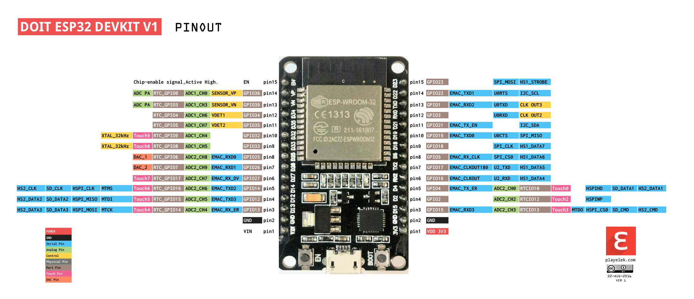

# ESP32 examples

Various examples for DOIT ESP32 DEVKIT V1 using Arduino IDE and TinyGo.

## DOIT ESP32 DEVKIT V1 pinout

[PDF version](pinout.pdf)

## Examples

- [Setup Arduino IDE](examples/Setup%20Arduino%20IDE.md)
- [Hello World](examples/Hello%20World/README.md)
- [Blinking LED](examples/Blinking%20LED/README.md)
- [Software Serial Console](examples/Software%20Serial%20Console/README.md)
- [Hardware Serial Console](examples/Hardware%20Serial%20Console/README.md)
- [Wi-Fi](examples/Wi-Fi/README.md)
- [Web API Request](examples/Web%20API%20Request/README.md)
- [8-Channel Transistor Array](examples/8-Channel%20Transistor%20Array/README.md)
- [SSR Relay](examples/SSR%20Relay/README.md)

## TinyGo examples

- [Setup TinyGo](tinygo-examples/Setup%20TinyGo.md)
- [Hello World](tinygo-examples/Hello%20World/README.md)

## Used software

- [Fritzing 0.9.9](https://github.com/Move2win/Fritzing-0.9.9.64.pc-Compiled-Build)
- [Arduino IDE](https://www.arduino.cc/en/software)

## Fritzing parts

- [DOIT ESP32 DEVKIT V1](https://github.com/Atsumitsu/fritzing-parts)
