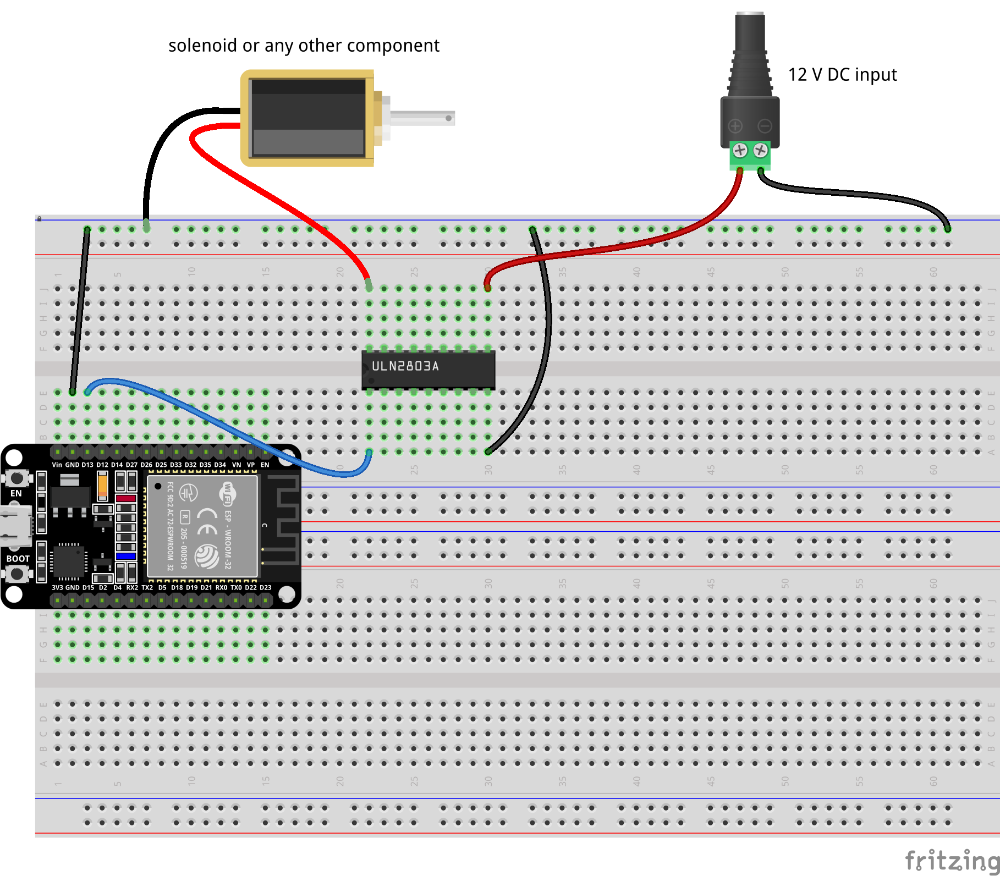

# 8-Channel Transistor Array

TODO 8-Channel Transistor Array

## Fritzing parts

- [Power supply 12V](https://forum.fritzing.org/t/power-supply-12v/23193)

## Sources

- [Spínací prvky - relé, tranzistory a tranzistorová pole](https://navody.dratek.cz/zaciname-s-arduinem/spinaci-prvky-rele-tranzistory-a-tranzistorova-pole.html)
