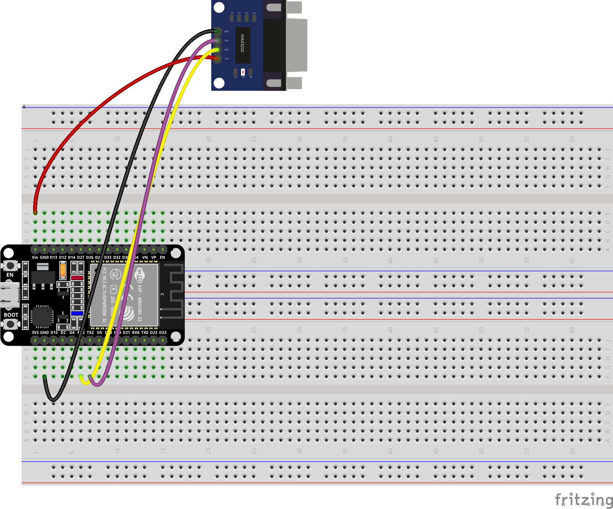

# Hardware Serial Console

This example is similiar to [Hello World example](../Hello%20World/README.md) except this time we are connecting trough RS232 serial port using [TTL RS232 conventer](https://www.laskakit.cz/prevodnik-ttl-na-rs232--max3232/):

You can connect it to your PC with [USB to RS232 conventer](https://www.laskakit.cz/prevodnik-usb-na-rs232--ch340/) or with ordinary serial cable if you have serial port on your PC.

Usage if pretty much the same as with Serial1. Here is echo example:

[TODO code](https://github.com/jsfraz/esp32-examples/blob/c9c8a3be0db80314e3bf3620e83c924fca9ac8ab/examples/Hardware%20Serial%20Console/sketch/sketch.ino#L1-L16)

## Sources

- [ESP32 RS232](https://esp32io.com/tutorials/esp32-rs232)
- [Second Serial Port on ESP32 WROOM module - robrs](https://forum.arduino.cc/t/second-serial-port-on-esp32-wroom-module/1022652/3)
