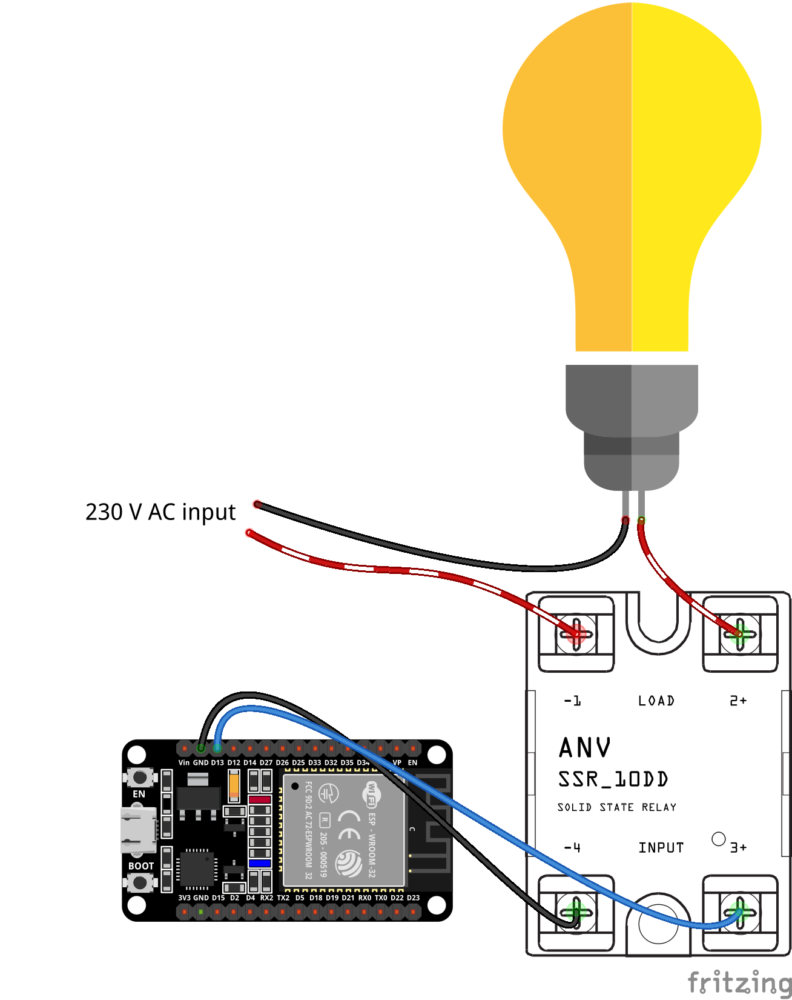

# SSR Relay

This circuit shows how to switch off an appliance with a 230 V load using an SSR relay.

## Fritzing parts

- [SSR-25-DD, Solid State Relay](https://forum.fritzing.org/t/ssr-25-dd-solid-state-relay/22673)
- [Custom light bulb](https://github.com/alfreddagenais/fritzing-components)

## Sources

- [Spínací prvky - relé, tranzistory a tranzistorová pole](https://navody.dratek.cz/zaciname-s-arduinem/spinaci-prvky-rele-tranzistory-a-tranzistorova-pole.html)
